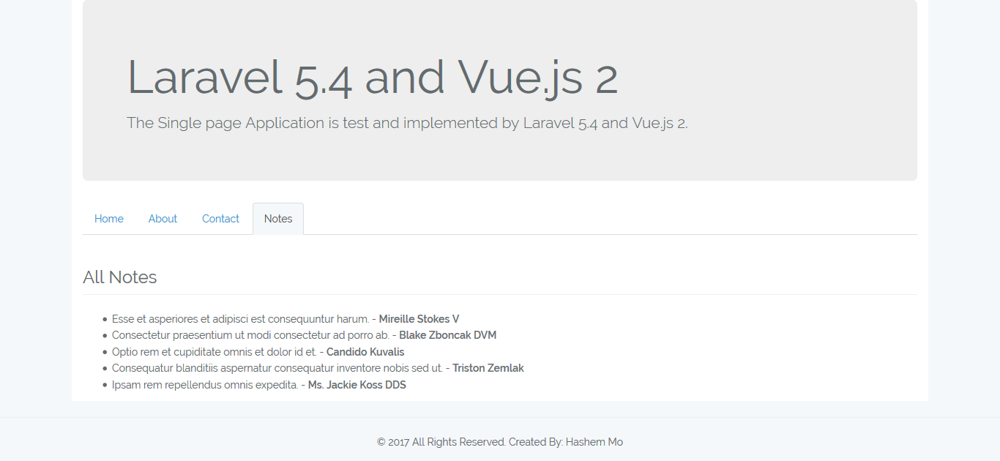
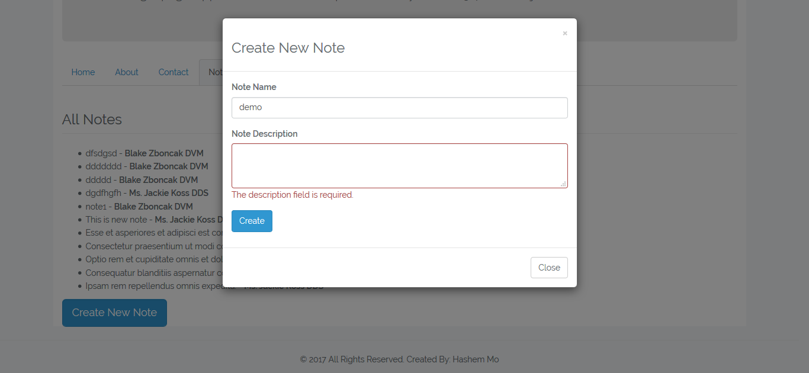

#Laravel-Vue


This basic SPA is boostrapped with Laravel 5.4, Vue.js 2, VueRouter, Axios and so much more !

##Features
* Basic Routing with VueRouter 2.0
* Use VueJS Components and Named Slots
* Use a Laravel component
* Web AJAX call with axios
* List Rendering with VueJS
* Validation form inputs

##Installation
* Clone or download the repository
```PHP
git clone https://github.com/hamog/Laravel-Vue.git
```

* CD in project root directory and Run
```PHP
cd Laravel-Vue/
composer install 
```
* Run 
```PHP
npm install
```

* Rename .env.example to .env

* Change your database credentials on the .env file

* Run the generate application key
```PHP
php artisan key:generate
```

* Run the migrations and seed data on your database
```PHP
php artisan migrate --seed
```

* Run 
```PHP
php artisan serve
```

* And you're good to go !

##CopyRight
This project is open for all.

